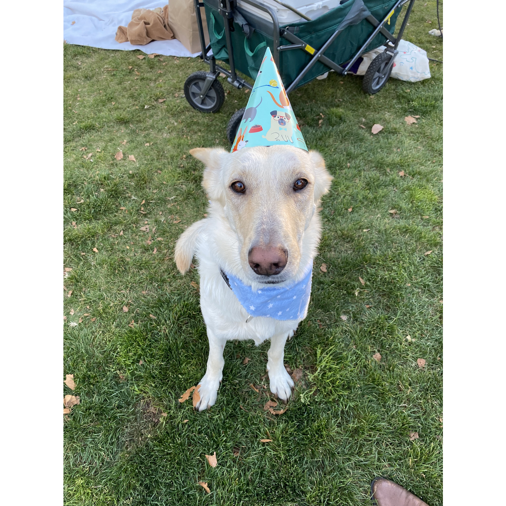
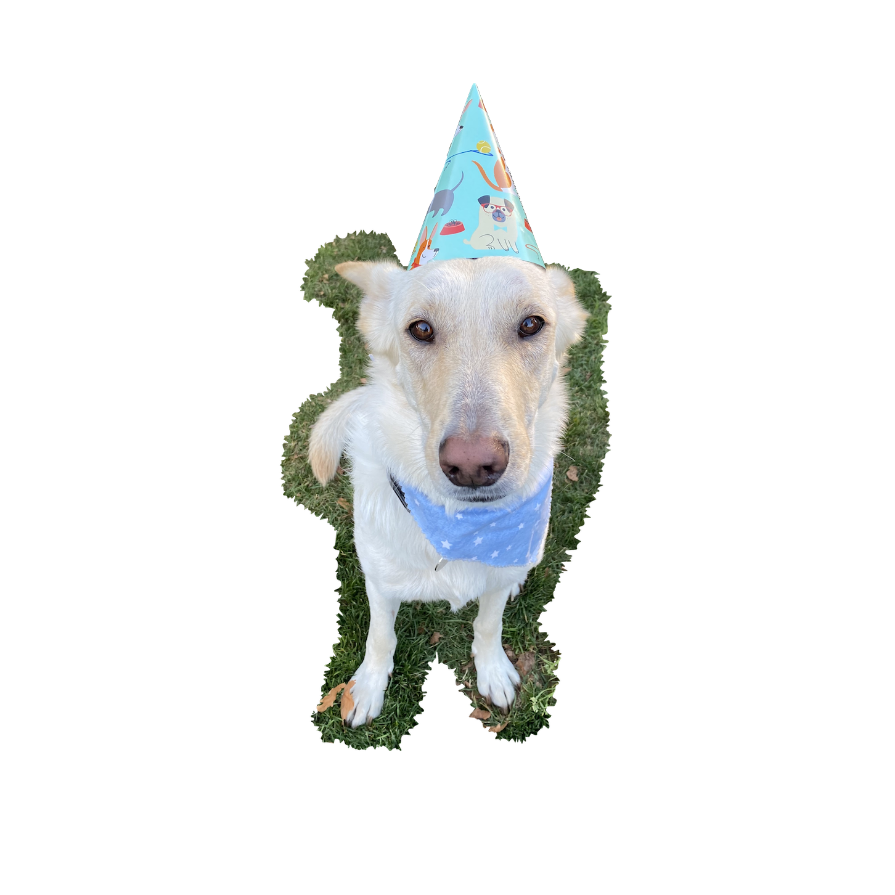

## Exploring Image AI with OpenAI 🤖 + Luna 🐕

[](https://runme.dev/api/runme?repository=https%3A%2F%2Fgithub.com%2Fsourishkrout%2Floon.git&fileToOpen=AI.md)

Luna is my white German Shepherd dog and she'll be helping us experiment with generative AI in this [runme.dev](https://runme.dev) notebook.

```sh { interactive=false mimeType=image/png }
cat hi_luna.png
```

## OpenAI's Dall-E

In this case, we chose to leverage OpenAI's Dall-E image editing capabilities. Let's jump in.

```sh
# homebrew on macOS or apt on Ubuntu
which brew && brew install jq curl | true
which apt && apt install && sudo apt install -y jq curl 2>/dev/null | true
```

### Do you have an OpenAI key?

That's really all you need. Please enter when prompted.

```sh { interactive=false }
export OPENAI_API_KEY=Your OpenAI key here
```

### What kinda scene would you like?

Describe the whole scene, not just the parts you'd like to be edited.

```sh { interactive=false mimeType=text/x-json }
export SCENE="a happy german shepherd dog surrounded by pizza"
export DALLE="$(curl https://api.openai.com/v1/images/edits \
  -H "Authorization: Bearer $OPENAI_API_KEY" \
  -F image="@luna.png" \
  -F mask="@luna_mask.png" \
  -F prompt="$SCENE" \
  -F n=1 \
  -F size="512x512" \
  -s)"
echo $DALLE | jq -c .
```

Give it a sec... OpenAI takes about ~20-40s to produce results.

```sh { interactive=false mimeType=image/png }
curl -s "$(echo $DALLE | jq -r '.data[0].url')"
```

## How it works

You basically give Dall-E two images:

1. The original image plus
2. A version of the same photo with roughly whatever you want to be replaced with generative imagery

Details are available in OpenAI's docs on [image edits](https://platform.openai.com/docs/guides/images/edits).

### Here are the two images included in the API request:

### The unmodified version.

What's more important is that the dimension match a square.



### The Masked Version

A version that acts like a mask (background 100% transparent) to let the AI know to *not* preserve the background.

One could use another AI to remove the background. In my case, I just used Apple's Preview which comes with smart lasso selection.


